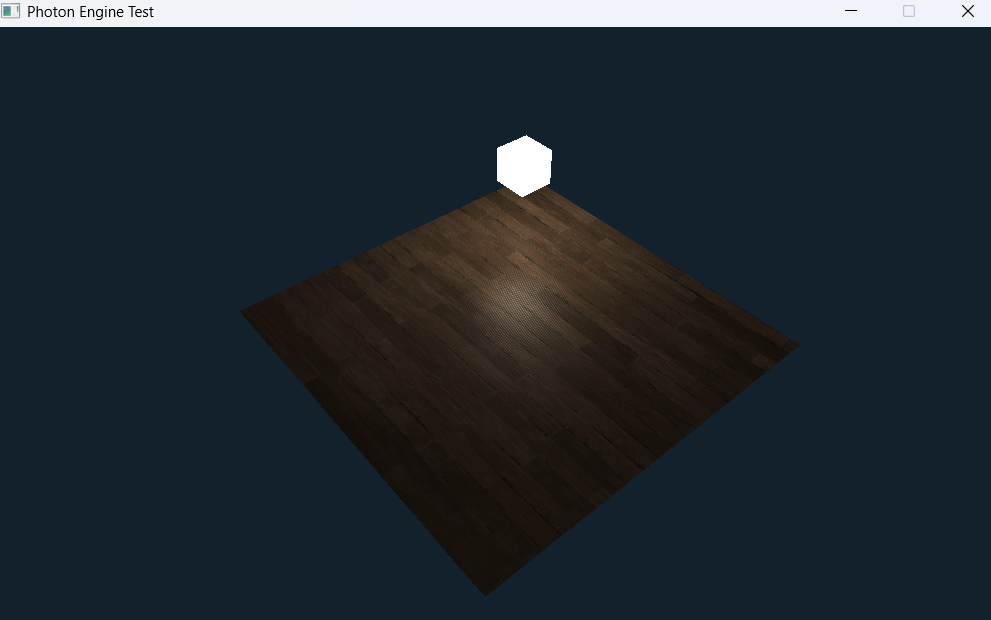
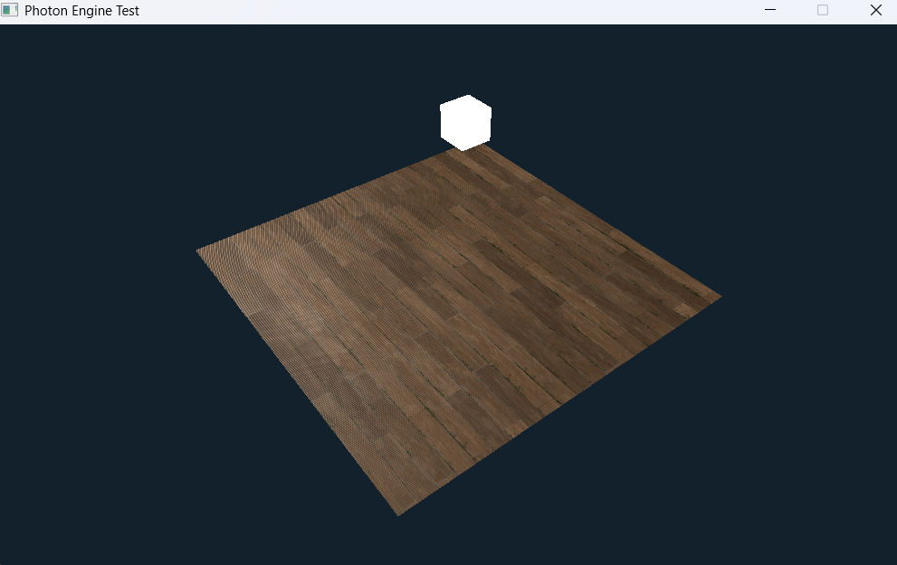
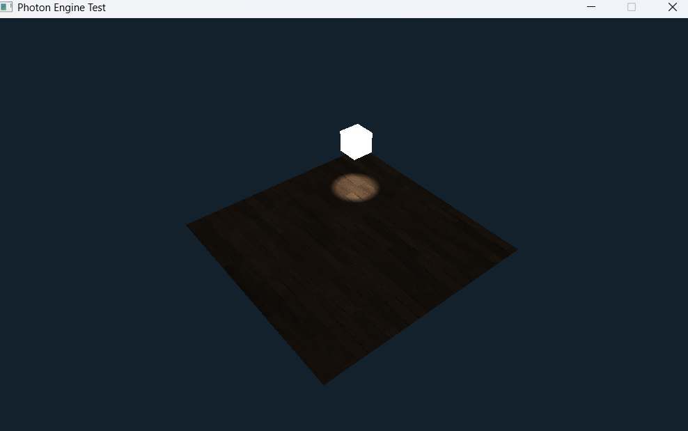

# Photon Engine

## About the Engine

Photon Engine is built using C with GLFW, OpenGL and STB libraries. This engine is only available for Windows. For Linux/MacOS, you might need to change the Makefile (and not use Docker). Thank you for visiting, to build and test your game, follow the instructions below.

## Build your Game

>Use ```docker run -it -v ${PWD}:/root/env <container-name>``` to run the docker container for making the development easier (for Windows users only).
>>If you haven't built the container yet, use ```docker build -f buildenv``` to build the docker container and then use the above command.
>Use ```make``` or ```make build-exe``` inside the container to build the game.
>Use ```exit``` to leave the container.

## Run/Test the Game

>Use ```.\build\game.exe``` or double click on ```game.exe``` to run the game.

## Engine Images






